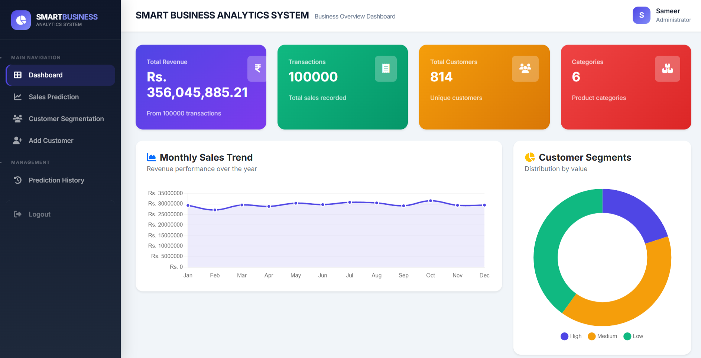
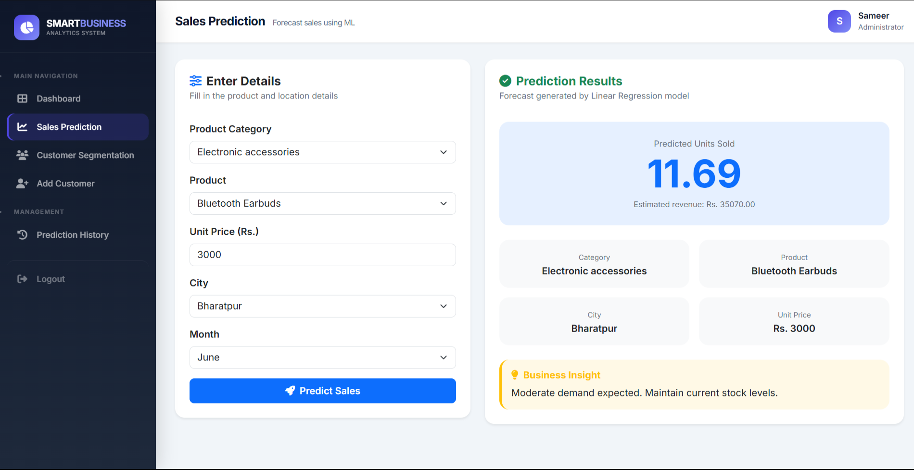
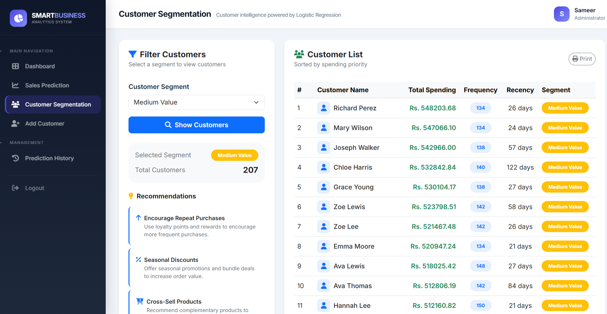

# Smart Business Analytics System


A web-based **Smart Business Analytics System** developed using **Python Flask**, **MySQL**, and **Machine Learning** to assist businesses in making data-driven decisions.

The application predicts future sales using **Linear Regression** and classifies customers into **High**, **Medium**, and **Low Value** segments using **Logistic Regression**, providing business insights through an interactive dashboard.

---

# 📌 Project Objectives

- Predict future product sales.
- Segment customers based on purchasing behavior.
- Manage customer and sales records.
- Visualize business analytics.
- Support better business decision-making.

---

# 🚀 Features

## 🔐 Authentication

- Admin Login
- Session Management
- Secure Logout

---

## 📊 Dashboard

- Business Summary
- Customer Statistics
- Sales Analytics
- Quick Navigation

---

## 👥 Customer Management

- Add Customer
- Update Existing Customer
- Duplicate Customer Detection
- Customer Segmentation

---

## 📈 Sales Prediction

- Predict Sales Quantity
- Predict Revenue
- Store Prediction History
- Manual Linear Regression Implementation

---

## 🎯 Customer Segmentation

- Manual Logistic Regression
- RFM Analysis
- High Value Customers
- Medium Value Customers
- Low Value Customers

---

## 🤖 Model Training

- Train Linear Regression Model
- Train Logistic Regression Model
- Save Trained Models

---

## 📜 Prediction History

- View Previous Predictions
- Store Prediction Results
- CSV-based Prediction History

---

# 🧠 Machine Learning Algorithms

## Linear Regression

Used for:

- Sales Quantity Prediction
- Revenue Prediction

Implemented from scratch using:

- Feature Scaling
- Gradient Descent
- Mean Squared Error
- Weight Optimization

---

## Logistic Regression

Used for:

- Customer Segmentation

Implemented from scratch using:

- Sigmoid Function
- Binary Cross Entropy
- Gradient Descent
- One-vs-Rest Classification

---

# 🛠️ Technologies Used

## Backend

- Python
- Flask

## Frontend

- HTML5
- CSS3
- JavaScript
- Bootstrap

## Database

- MySQL

## Machine Learning

- NumPy
- Pandas

## Development Tools

- Visual Studio Code
- Git
- GitHub
- XAMPP

---

# 📁 Project Structure

```text
SMART BUSINESS ANALYTICS SYSTEM
│
├── dataset/
│   └── Supermarket Sales Dataset
│
├── ml/
│   ├── linear_regression.py
│   ├── logistic_regression.py
│   └── preprocessing.py
│
├── models/
│
├── routes/
│   ├── __init__.py
│   ├── auth.py
│   ├── dashboard.py
│   ├── add_customer.py
│   ├── prediction.py
│   ├── history.py
│   └── train.py
│
├── Screenshots/
│   ├── Dashboard.png
│   ├── Sales_Prediction.png
│   └── Customer_Segmentation.png
│
├── scripts/
│
├── static/
│   ├── css/
│   ├── js/
│   └── images/
│
├── templates/
│   ├── login.html
│   ├── layout.html
│   ├── dashboard.html
│   ├── customers.html
│   ├── add_customer.html
│   ├── prediction.html
│   ├── history.html
│   └── train.html
│
├── tests/
│
├── trained_models/
│
├── utils/
│
├── app.py
├── config.py
├── database.py
├── init_db.py
├── prediction_history.csv
└── requirements.txt
```

---

# ⚙️ Installation

## Clone Repository

```bash
git clone https://github.com/sangyaaa/Smart-Business-Analytics-System.git
```

```
cd Smart-Business-Analytics-System
```

---

## Create Virtual Environment

Windows

```bash
python -m venv .venv
```

Activate

```bash
.venv\Scripts\activate
```

Linux/macOS

```bash
python3 -m venv .venv
source .venv/bin/activate
```

---

## Install Required Packages

```bash
pip install -r requirements.txt
```

---

## Configure MySQL Database

Update your database credentials inside

```
config.py
```
---

## Initialize Database

```bash
python init_db.py
```

---

## Train Machine Learning Models

```bash
python routes/train.py
```

---

## Run the Application

```bash
python app.py
```

---

# 📊 System Workflow

```
User
 │
 ▼
Flask Application
 │
 ├─────────────┐
 │             │
 ▼             ▼
MySQL     Machine Learning
                 │
       ┌─────────┴─────────┐
       ▼                   ▼
Linear Regression    Logistic Regression
```

---

# 🧠 Machine Learning Workflow

## Linear Regression

```
Dataset

↓

Clean Data

↓

Feature Scaling

↓

Initialize Parameters

↓

Gradient Descent

↓

Train Model

↓

Predict Sales

↓

Save Model
```

---

## Logistic Regression

```
Dataset

↓

Generate RFM Features

↓

Normalize Data

↓

Train Model

↓

Sigmoid Function

↓

Customer Classification

↓

Save Model
```

---

# 📸 Screenshots

## Dashboard



---

## Sales Prediction



---

## Customer Segmentation



---

# 🧪 Testing

The application includes testing for:

- Login Module
- Customer Management
- Dashboard
- Sales Prediction
- Customer Segmentation
- Database Operations
- Machine Learning Models

---

# 📈 Future Enhancements

- Cloud Deployment
- REST API
- Email Notifications
- Real-Time Business Dashboard
- Advanced Data Visualization
- Deep Learning Models
- Automatic Model Retraining


---

# 📄 License

This project was developed as a **Bachelor of Science in Computer Science and Information Technology (B.Sc. CSIT) Final Year Project** for academic purposes.

---